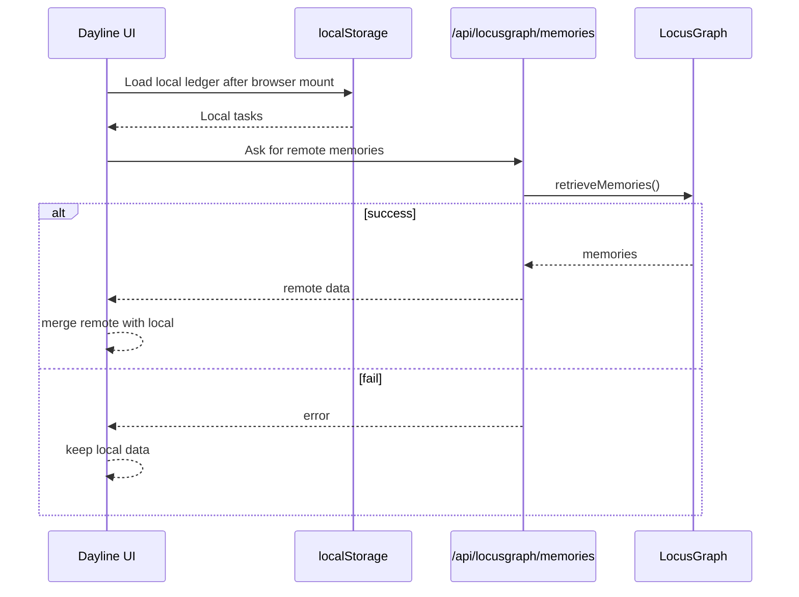
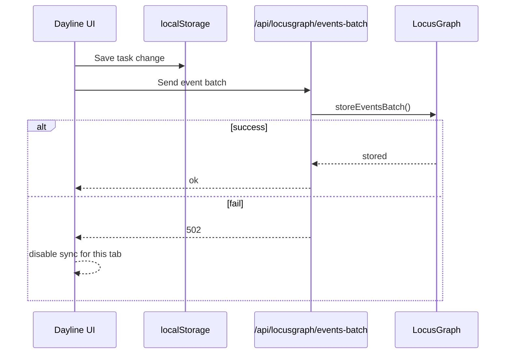

# 04. Architecture Diagrams

These diagrams show the LocusGraph workflow visually.

## Simple Architecture

```mermaid
flowchart TD
  User[User]
  UI[Dayline UI]
  Local[Browser localStorage]
  API[Next.js API routes]
  SDK[@locusgraph/client]
  LG[LocusGraph]

  User --> UI
  UI --> Local
  UI --> API
  API --> SDK
  SDK --> LG
```

Meaning:

- UI always saves to localStorage.
- API routes are only used for remote sync.
- SDK talks to LocusGraph.

## App Startup



## Task Change Sync



## Oracle Insight

```mermaid
flowchart LR
  Local[localStorage last 7 days]
  Card[OracleCard]
  API[/api/locusgraph/insights]
  AI[Anthropic]

  Local --> Card
  Card --> API
  API --> AI
  AI --> API
  API --> Card
```

Meaning:

- Oracle uses local task history.
- Oracle needs `ANTHROPIC_API_KEY`.
- Oracle is separate from normal LocusGraph sync.
